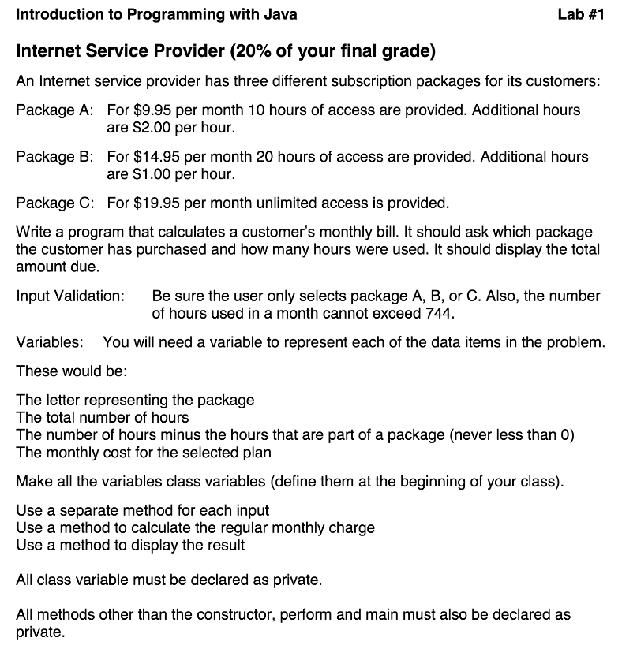
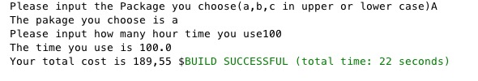
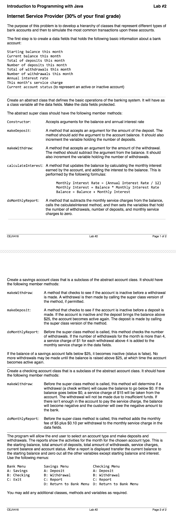
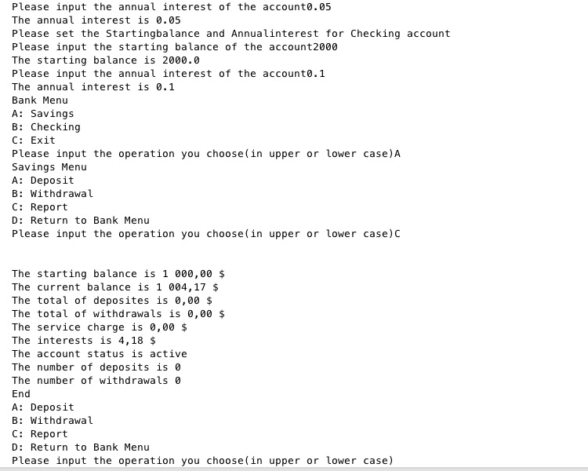
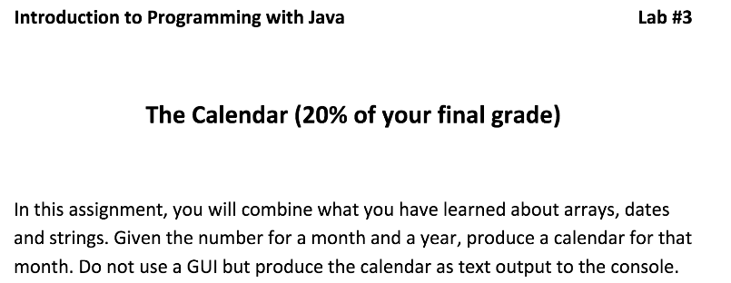
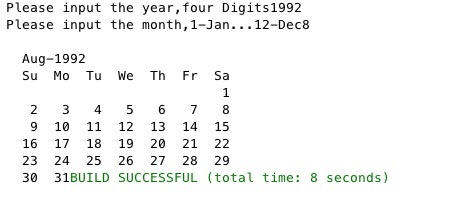

# Java416
This repository is created for the Introduction to Java Programming

## Assignment1

#### The user need to choose the package and the times the use then the this program will calculate the fees for the users.

## Assignment2

#### The user need to set the initial amount and interest for the both the saving account and the checking account.
#### The it will go to the main menu, where user can select Saving Account, Checking Account or exit the program.
#### After choosing the Saving Account or Checking Account, the user can deposite, withdral or see the bank statement.

## Assignment3

#### The user input the four-digits number of year and month, then the program will output the calender for the user.

